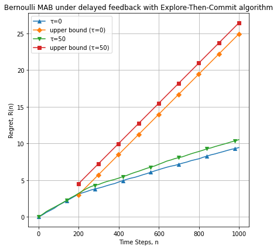
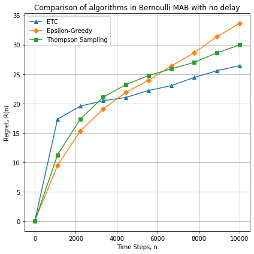
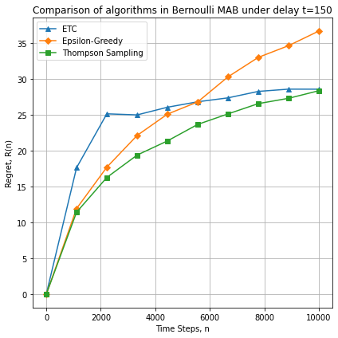

# Multi-armed bandit (MAB) problem under delayed feedback: numerical experiments


Provides the framework for numerical experiments to simulate the multi-armed bandit problem
in the stochastic stationary environment with delays. Part of the paper [Bernoulli multi-armed bandit problem under delayed feedback](https://djo.github.io/assets/bernoulli-multi-armed-bandit-problem-under-delayed-feedback.pdf)
([Journal](https://bphm.knu.ua/index.php/bphm/article/view/214)).

Structure of the project and currently implemented algorithms:

||Files|
|-|-|
|Environments|[Protocol](delayed_bandit/environments/environment.py)|
||[Bernoulli MAB](delayed_bandit/environments/bernoulli_bandit.py)|
|Policies|[Protocol](delayed_bandit/policies/policy.py)|
||[Uniform Random](delayed_bandit/policies/uniform_random.py)|
||[Explore-First](delayed_bandit/policies/etc.py)|
||[Epsilon-Greedy](delayed_bandit/policies/epsilon_greedy.py)|
||[Upper Confidence Bound](delayed_bandit/policies/ucb.py)|
||[Thompson Sampling (Beta distribution)](delayed_bandit/policies/beta_thompson_sampling.py)|
|Experiments|[Bernoulli MAB under delayed feedback](delayed_bandit/experiments.py)|
|Tests|[Test module](delayed_bandit/test/)|

To run experiments on Bernoulli MAB see
```
python delayed_bandit/experiments.py --help
```

One might want to run a significant number of experiments and aggregate the result by removing outliers and averaging.
The sampling of delays might be fixated over the horizon.








### Development

```
python3 -m venv env
source env/bin/activate
pip install -r requirements.txt
./pychecks.sh
```

MIT License

Copyright (c) 2021 Andrii Dzhoha
