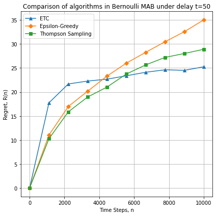

# Multi-armed bandit (MAB) problem under delayed feedback: numerical experiments


Provides the framework for numerical experiments to emulate the stochastic stationary environment with no delays
for the algorithms designed for the sequential resource allocation (MAB) when rewards are in fact delayed.

The implementation is based on [Multi-Armed Bandit Problems under Delayed Feedback](https://era.library.ualberta.ca/items/29b7d797-1ad1-463b-b48b-2cdb0f0730f5) work.

Structure of the project and currently implemented algorithms:

||Files|
|-|-|
|Environments|[Protocol](delayed_bandit/environments/environment.py), [Bernoulli MAB](delayed_bandit/environments/bernoulli_bandit.py)|
|Policies|[Protocol](delayed_bandit/policies/policy.py), [Explore-Then-Commit](delayed_bandit/policies/etc.py), [Epsilon-Greedy](delayed_bandit/policies/epsilon_greedy.py), [Thompson Sampling (Beta)](delayed_bandit/policies/beta_thompson_sampling.py)|
|Experiments|[Bernoulli MAB under delayed feedback](delayed_bandit/experiments.py)|
|Jupyter notebooks|*TODO: Bernoulli MAB under delayed feedback*|
|Tests|[test module](delayed_bandit/test/)|

To run experiments on Bernoulli MAB see
```
python delayed_bandit/experiments.py --help
```

One might want to run a significant number of experiments and aggregate the end result by removing outliers and averaging.
The sampling of delays might be fixated over all runs.





Created as a part of the paper "Multi-armed bandit problem in the delayed setting" (*TODO: link*)
in order to provide the framework for numerical experiments.

### Development

```
python3 -m venv env
source env/bin/activate
pip install -r requirements.txt
pytest
```

MIT License

Copyright (c) 2021 Andrii Dzhoha
